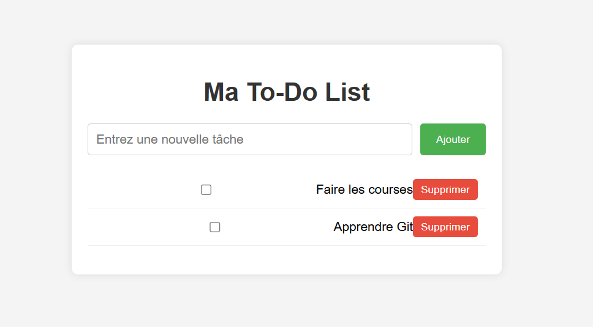

# To-Do List

Une application web simple pour gérer vos tâches quotidiennes.

## Fonctionnalités
- Ajouter une nouvelle tâche
- Marquer une tâche comme terminée (barrée)
- Supprimer une tâche
- Sauvegarde des tâches dans le navigateur (LocalStorage)

## Technologies utilisées
- **HTML** : Structure de la page
- **CSS** : Design de l'interface
- **JavaScript** : Logique et gestion des tâches

## Installation
1. Clonez le dépôt :
   ```bash
   git clone https://github.com/ton-pseudo/todo-list.git


## Capture d’écran
